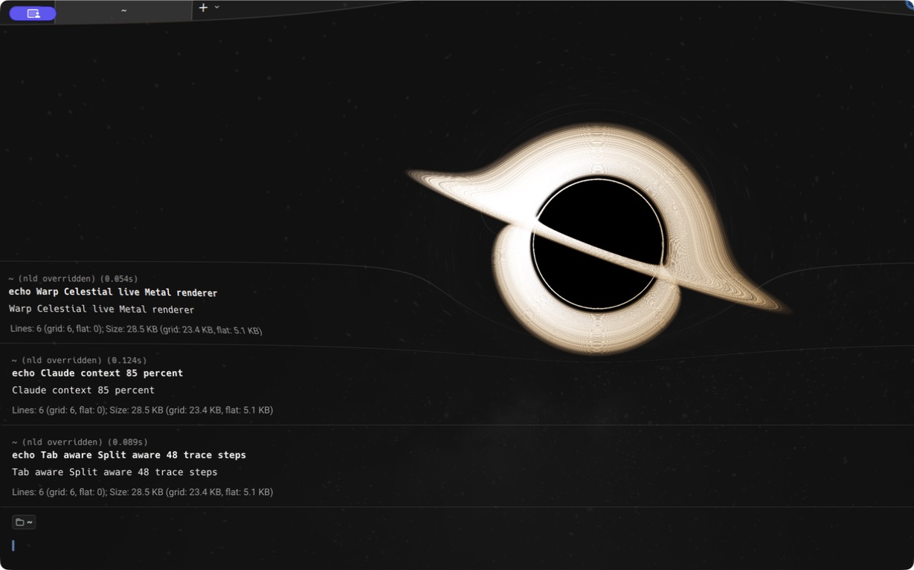
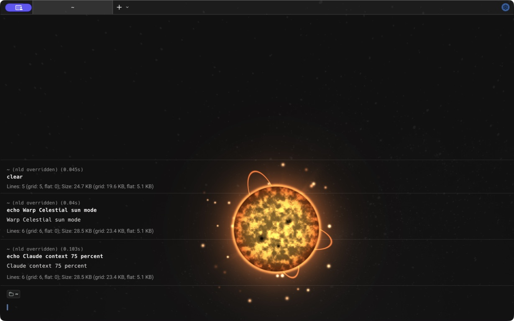

# Warp Celestial

[Chinese version](README.zh-CN.md)

Warp Celestial adds a geodesic-traced black hole or animated sun to the macOS
Metal renderer in [Warp](https://github.com/warpdotdev/warp). The black hole
physically lenses terminal content through a Schwarzschild ray integrator, and
its size follows the focused Claude Code pane's context-window usage.

| Black hole — 85% context | Sun — 75% context |
| --- | --- |
|  |  |

Both images are captures from the locally built patched app, not generated
mockups.

## Requirements

- macOS
- The full Xcode app, opened at least once with its additional components installed
- Rust and Cargo from [rustup](https://rustup.rs)
- Git and Python 3.8 or newer
- At least 25 GB of free disk space for the Warp source and build artifacts
- Homebrew only when `jq` is not already installed

The installer checks these requirements before changing anything. Xcode Command
Line Tools alone are not enough because the shader must be compiled with the
Metal toolchain included in the full Xcode app.

## Quick install

```bash
git clone https://github.com/majiayu000/warp-celestial.git
cd warp-celestial
./install.sh
```

The first build can take 10-30 minutes. The installer explains each long-running
step and asks before installing build helpers or changing Claude Code settings.
To upgrade an existing installation, pull the latest repository changes and run
`./install.sh` again. The installer migrates the previous managed renderer patch
in place, so the Warp source does not need to be cloned again.

To check the machine without installing anything:

```bash
./install.sh --check
```

To diagnose both prerequisites and an existing installation:

```bash
./install.sh --doctor
```

Useful options:

```text
--skip-claude-config    Build the app without editing Claude Code settings
--no-launch             Do not open the app after installation
--clean-build-cache     Reclaim compiled build space without uninstalling the app
--uninstall             Safely remove the app and its managed Claude integration
--yes                   Accept prompts; required for non-interactive installation
```

## What the installer does

1. Verifies macOS, full Xcode, Metal tools, Rust, Python, Git and disk space.
2. Installs `jq` through Homebrew when needed and installs Warp's pinned
   `cargo-bundle` into the project support directory through Cargo.
3. Clones Warp at the tested commit `69ce3728` into
   `~/.local/share/warp-celestial/warp`.
4. Applies `patches/celestial-effect.patch` and builds the public OSS app. No
   Firebase key or private Warp repository is required.
5. Installs the app as `~/Applications/Warp Celestial.app`.
6. Installs the context bridge at
   `~/.local/share/warp-celestial/claude-token.py` and the launcher at
   `~/.local/bin/warp-celestial`.
7. With confirmation, backs up `~/.claude/settings.json`, adds the top-level
   `statusLine` command, and merges `SessionStart`/`SessionEnd` lifecycle hooks
   without changing unrelated settings or hooks.
8. Records which Claude settings it owns, allowing uninstall to restore a
   previous status line without overwriting changes made after installation.

The installer is repeatable. Running it again reuses the pinned source checkout
and Cargo build cache. If it cannot verify the pinned commit and patch state, it
stops instead of resetting or deleting the checkout.

## Releases and compatibility

The current project version is `0.1.1`; no successful GitHub release has been
published yet. The existing `v0.1.0` tag triggered a failed release and is
immutable: do not delete, move or reuse it. After this recovery change is
merged and main CI passes, `v0.1.1` must be created from `main` as the first
publishable recovery tag.

`COMPATIBILITY.json` is the machine-checked source of truth for the project
version, Warp commit, renderer patch digest, Rust toolchain and bundler
revision. CI rejects drift between that manifest, `VERSION`, `Cargo.toml`,
`Cargo.lock`, `install.sh` and the patch itself. A weekly non-mutating probe
reports whether the same patch still applies to the latest public Warp
`master`.

For `v0.1.1` and later tags, the release workflow verifies that the exact
`vVERSION` tag points to a commit contained in `main`, then reruns the complete
Python, Rust, Metal, Warp patch and clippy gates before publishing source plus a
SHA-256 checksum. It does not publish a prebuilt app:
local builds are ad-hoc signed, and publishing a trusted binary requires an
Apple Developer signing identity, notarization and the corresponding AGPL
source distribution. The repository is licensed under AGPL-3.0; adapted MIT
work remains identified in `THIRD_PARTY_NOTICES.md`.

## Running it

Restart Claude Code after the first installation so it reloads the status-line
configuration. Then open `Warp Celestial.app` from `~/Applications`, or use:

```bash
~/.local/bin/warp-celestial blackhole
~/.local/bin/warp-celestial sun
```

The optional second argument selects the GPU cost: `auto` (the default, choosing
24/36/48 trace steps from the current context fill), `low` (fixed 24),
`balanced` (fixed 36), or `high` (fixed 48). For example:

```bash
~/.local/bin/warp-celestial blackhole low
```

`auto` uses 24 steps below 35% context fill, 36 steps from 35% to below 75%,
and 48 steps at 75% or above. Demo mode still defaults to `high` so captures are
visually consistent.

The default is `blackhole`. The effect is intentionally hidden when Claude Code
reports no active context usage. To preview it without waiting for a session:

```bash
~/.local/bin/warp-celestial --demo
```

`--demo` launches a separate app process with a fixed 65% context level. It
does not modify context records and remains active until that app process exits.
It accepts an effect, quality and optional fill value:

```bash
warp-celestial --demo blackhole high 0.85
warp-celestial --demo sun high 0.75
warp-celestial --demo low
```

See [the demo capture guide](docs/DEMO.md) for reproducible screenshot and video
shots. Published media should come from the real patched app.

If `~/.local/bin` is on your `PATH`, the shorter commands work too:

```bash
warp-celestial blackhole
warp-celestial sun
warp-celestial --demo
```

## How it works

The system has two small parts and one patched renderer:

```text
Claude Code statusLine JSON
          |
          v
claude-token.py
          |
          |  stores one record per session, aggregates within this pane
          v
~/.cache/warp/blackhole_contexts/<pane>/<session>.context
          |
          |  signed OSC 12 cursor-color signal
          v
focused Warp tab / split pane
          |
          v
Warp Metal renderer (smoothed 0.0-to-1.0 uniform)
  1. render inactive scenes directly to the drawable
  2. render active scenes to a reusable offscreen BGRA texture
  3. integrate near-field Schwarzschild photon paths per pixel
  4. apply terminal lensing, repeated disk crossings and relativistic light
  5. present the composited frame
```

### Context bridge

Claude Code sends JSON to its configured `statusLine` command. The standalone
`claude-token.py` calculates the fill ratio from `used_percentage`, or from
total tokens divided by context-window size when needed. It clamps the result
to `0.0..1.0`, writes the session record atomically, takes the maximum of the
live sessions in the same pane, and encodes that value into a checksummed OSC
12 cursor color. Ordinary theme cursor colors cannot accidentally match the
signature.

The installer registers the same script for Claude Code's `SessionStart` and
`SessionEnd` hooks. A start creates a zero record; an end removes only that
session and republishes the remaining pane maximum. With no sessions left, the
script restores the normal cursor color. The OSC sequence is written directly
to the inherited terminal instead of polluting the status-line output.

### Metal renderer

The patch changes only Warp's macOS Metal backend. While the effect is active,
the normal terminal scene is rendered into a reusable offscreen texture. A
second full-screen pass samples that texture and runs one of two fragment
shaders:

- `blackhole_fragment`: numerically integrated Schwarzschild geodesics,
  physically captured rays, multi-image accretion disk, blackbody temperature,
  Doppler shift/beaming, time dilation, traced photon-sphere caustics, turbulent
  bright knots and weak-field lensing
- `sun_fragment`: limb-darkened photosphere, granulation, sunspots, corona,
  magnetic prominence arches and quality-scaled procedural embers

Set `WARP_CELESTIAL=sun` before launch to select the sun. Any other value selects
the black hole. The focused pane publishes a zero-sized transparent marker into
the current scene, so the signal survives cursor blinks and CLI rich input while
the renderer glides between context updates rather than changing size in one frame.

### Resource use

While the fill value is zero, the window uses Warp's normal event-driven redraw
behavior, renders the scene directly to the drawable, and skips both the
offscreen texture and celestial composite pass. It also releases a retained
offscreen texture once the fade-out settles. While fill is above zero, the
window redraws at display rate so the shader can move. The active path reuses
the offscreen texture and preserves the cached scene between animation frames.
Warp performs no filesystem scan: the pane-local value arrives in the scene it
already renders.

This costs more GPU time and memory bandwidth than stock Warp because an active
effect adds a full-screen pass, and pixels near the hole integrate 24-48 ray
steps. Pixels in the protected bottom work area exit early; distant pixels use
a cheaper analytic approximation. Larger Retina windows and high-refresh-rate
displays cost more. Sun particles are capped at 12, 20 or 28 for low, balanced
or high quality and are evaluated only close to the star. Normal use defaults
to `auto`; choose `low` to prioritize battery life or `high` for recordings.
Close the custom app or end the focused Claude session to stop continuous
rendering.

### Tabs, panes and concurrent sessions

Each Claude session writes its own record under the stable Warp terminal pane
ID inherited through `WARP_TERMINAL_SESSION_UUID`. Multiple Claude sessions in
one pane aggregate by maximum, so ending one cannot erase another. Different
tabs and split panes publish independent cursor signals. Warp renders only the
active tab, and only the focused split publishes an invisible scene marker, so
changing tab or split focus changes the window-wide effect to that pane's level.
An active pane with no Claude signal fades the effect out after the short signal
grace period. Session records carry a last-update timestamp and expire after 24
hours, so a Claude or terminal crash that skips `SessionEnd` cannot leave a
permanent stale maximum. Legacy float-only records use their file modification
time for the same expiry rule.

## Manual installation

The installer is recommended, but the exact source procedure is:

```bash
git clone --filter=blob:none https://github.com/warpdotdev/warp.git
cd warp
git checkout 69ce3728acae0b01c2f457b65a90c144664686aa
git apply /path/to/warp-celestial/patches/celestial-effect.patch

cargo install cargo-bundle \
  --git https://github.com/burtonageo/cargo-bundle \
  --rev 739f92c37c789b5511a448a389cbc76fcebd99df

export DEVELOPER_DIR=/Applications/Xcode.app/Contents/Developer
export WARP_BIN_NAME=warp-oss
export WARP_CHANNEL=oss
export FEATURES=gui
./script/macos/run --dont-open
```

The bundle is created at `target/debug/bundle/osx/WarpOss.app` unless Cargo is
configured to use a different target directory.

To configure Claude Code manually:

```json
{
  "statusLine": {
    "type": "command",
    "command": "/absolute/path/to/claude-token.py"
  },
  "hooks": {
    "SessionStart": [{
      "hooks": [{
        "type": "command",
        "command": "/absolute/path/to/claude-token.py"
      }]
    }],
    "SessionEnd": [{
      "hooks": [{
        "type": "command",
        "command": "/absolute/path/to/claude-token.py"
      }]
    }]
  }
}
```

Preserve any other keys already present in `~/.claude/settings.json`.

## Troubleshooting

### The installer says the Metal compiler is missing

Install the full Xcode app, open it once, and allow its additional components to
finish installing. If first-launch setup is incomplete, run:

```bash
sudo xcodebuild -runFirstLaunch
```

Then retry `./install.sh --check`.

### The app opens but no effect appears

Run `~/.local/bin/warp-celestial --demo`. If the demo works, restart Claude Code
so it reloads `statusLine`, then confirm that this file changes during a session:

```bash
find ~/.cache/warp/blackhole_contexts -maxdepth 3 -name '*.context' -print -exec cat {} \;
```

### Claude Code already has a custom status line

The installer creates a timestamped backup before replacing `statusLine`. It
preserves existing lifecycle hooks and adds its commands beside them, but it
does not merge two status-line programs. Use `--skip-claude-config` if you want
to combine the status lines manually.

### The managed Warp checkout has unexpected changes

The installer refuses to reset or delete modified source. Move
`~/.local/share/warp-celestial/warp` elsewhere, or remove it after saving any
work you need, then run the installer again.

## Removing the local installation

Run:

```bash
./install.sh --uninstall
```

The uninstaller removes the app, launcher, managed source/build directory and
context cache. It removes only the exact Claude hooks installed by this project.
If the installer replaced an earlier status line, it restores that value only
when the current value is still managed by Warp Celestial; later user edits are
left untouched. Timestamped Claude settings backups are preserved.

Recursive removal requires a private ownership marker bound to the canonical
directory. Custom support/cache roots must stay below `HOME` and end in
`warp-celestial`/`blackhole_contexts`; broad or unowned paths are rejected. If a
pre-existing Claude configuration still references the bridge but was never
claimed by Warp Celestial, uninstall stops and preserves the bridge instead of
leaving a broken command.

To keep the installed app but reclaim the large Cargo build directory:

```bash
./install.sh --clean-build-cache
```

## Repository contents

| Path | Purpose |
| --- | --- |
| `install.sh` | Preflight, build, app installation and safe Claude configuration |
| `COMPATIBILITY.json` | Machine-checked Warp, patch and toolchain compatibility |
| `CHANGELOG.md` | Release history |
| `scripts/configure_claude.py` | Atomic, preserving update of Claude Code settings |
| `scripts/check_compatibility.py` | Release and installer pin consistency checks |
| `scripts/install_safety.sh` | Managed-directory ownership and removal guards |
| `scripts/warp_celestial_launcher.py` | Validated effect, quality and demo launcher |
| `patches/celestial-effect.patch` | Complete Warp source patch |
| `claude-token.py` | Claude Code context-to-renderer bridge |
| `THIRD_PARTY_NOTICES.md` | Attribution and MIT notice for adapted work |
| `blackhole.png` | README preview captured from the real patched app |
| `warp-channel-config.example` | Optional local-development stub; not used by the installer |
| `src/main.rs` | Historical standalone Metal proof of concept |
| `PLAN.md` | Current capabilities, next work and release gates |

## Limitations and license

- The renderer patch currently supports macOS Metal only.
- The patch is pinned to Warp commit `69ce3728`; newer Warp revisions may need a
  rebase.
- The locally built OSS app is ad-hoc signed, not Apple-notarized.
- Warp Celestial and the patched Warp derivative are distributed under
  AGPL-3.0; see `LICENSE`.
- The geodesic renderer and cursor-channel protocol retain the upstream MIT
  attribution documented in `THIRD_PARTY_NOTICES.md`.
