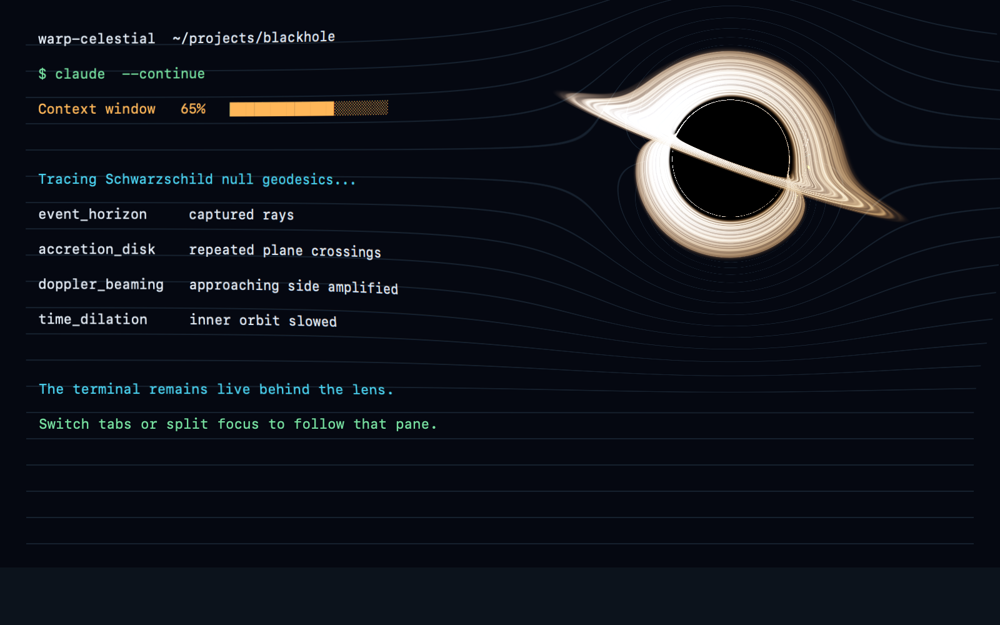

# Warp Celestial 中文说明

[English README](README.md)

Warp Celestial 为 macOS 版 Warp 的 Metal 渲染器加入基于测地线追踪的黑洞或
动态太阳效果。黑洞通过 Schwarzschild 光线积分真实扭曲终端内容，大小由当前
焦点 Claude Code Pane 的上下文窗口使用比例驱动。



## 环境要求

- macOS
- 完整版 Xcode，并且至少启动过一次、完成附加组件安装
- 通过 [rustup](https://rustup.rs) 安装的 Rust 和 Cargo
- Git 与 Python 3.8 或更高版本
- 至少 25 GB 可用磁盘空间，用于 Warp 源码和编译产物
- 仅在系统没有 `jq` 时需要 Homebrew

只有 Xcode Command Line Tools 不够，因为 Metal shader 编译器包含在完整
Xcode 中。安装器会先完成检查，再修改任何文件。

## 一键安装

```bash
git clone https://github.com/majiayu000/warp-celestial.git
cd warp-celestial
./install.sh
```

第一次编译通常需要 10-30 分钟。安装器会解释耗时步骤，并在安装辅助工具或
修改 Claude Code 配置前询问确认。
升级已有安装时，拉取仓库最新代码后再次运行 `./install.sh`。安装器会原地迁移
上一版受管理的 renderer patch，无需重新克隆 Warp 源码。

只检查环境、不执行安装：

```bash
./install.sh --check
```

常用选项：

```text
--skip-claude-config    不修改 Claude Code 配置
--no-launch             安装完成后不启动应用
--yes                   自动接受询问；非交互安装时必须显式提供
```

## 安装器具体做什么

1. 检查 macOS、完整 Xcode、Metal 工具、Rust、Python、Git 和磁盘空间。
2. 缺少 `jq` 时通过 Homebrew 安装，并通过 Cargo 安装 Warp 固定版本的
   `cargo-bundle`。
3. 把经过验证的 Warp 提交 `69ce3728` 克隆到
   `~/.local/share/warp-celestial/warp`。
4. 应用 `patches/celestial-effect.patch`，构建公开的 OSS 版本；不需要
   Firebase Key，也不需要 Warp 私有仓库权限。
5. 把应用安装为 `~/Applications/Warp Celestial.app`。
6. 把上下文桥接脚本安装到
   `~/.local/share/warp-celestial/claude-token.py`，把启动器安装到
   `~/.local/bin/warp-celestial`。
7. 经用户确认后，备份 `~/.claude/settings.json`，更新顶层 `statusLine`，
   并合并 `SessionStart`/`SessionEnd` 生命周期 hooks，保留其他配置和 hooks。

安装器支持重复运行，会复用固定版本的源码和 Cargo 编译缓存。如果无法验证
固定提交和补丁状态，它会停止并报告，不会 reset 或删除源码目录。

## 如何运行

首次安装后请重启 Claude Code，使其重新读取 `statusLine` 配置。之后可以从
`~/Applications` 打开 `Warp Celestial.app`，也可以运行：

```bash
~/.local/bin/warp-celestial blackhole
~/.local/bin/warp-celestial sun
```

第二个可选参数用于选择 GPU 开销：`low`（24 步光线积分）、`balanced`
（36 步，默认）或 `high`（48 步）。例如：

```bash
~/.local/bin/warp-celestial blackhole low
```

默认效果是黑洞。Claude Code 没有上报上下文占用时，天体会隐藏，这是预期
行为。想立即预览可以运行：

```bash
~/.local/bin/warp-celestial --demo
```

`--demo` 会启动一个固定为 65% 上下文占用的独立应用进程，不会修改上下文缓存；
效果持续到该进程退出。也可以使用 `--demo low` 指定性能档位。

如果 `~/.local/bin` 已加入 `PATH`，可以使用短命令：

```bash
warp-celestial blackhole
warp-celestial sun
warp-celestial --demo
```

## 运行原理

整体数据流如下：

```text
Claude Code statusLine JSON
          |
          v
claude-token.py
          |
          |  每会话保存记录，并在当前 Pane 内聚合
          v
~/.cache/warp/blackhole_contexts/<pane>/<session>.context
          |
          |  带校验签名的 OSC 12 光标颜色信号
          v
当前焦点 Warp Tab / 分屏 Pane
          |
          v
Warp Metal 渲染器（平滑后的 0.0 到 1.0 uniform）
  1. 把正常终端场景渲染到离屏 BGRA 纹理
  2. 逐像素积分近场 Schwarzschild 光子路径
  3. 添加终端透镜、多次吸积盘穿越和相对论光照
  4. 输出最终合成画面
```

### Tab、Pane 与并发会话

每个 Claude 会话会按照继承的 `WARP_TERMINAL_SESSION_UUID` 写入自己的记录。
同一 Pane 内多个 Claude 会话取最大值，结束一个会话不会清空其他会话。不同 Tab
和分屏 Pane 会发布独立的光标信号；Warp 只渲染活动 Tab，并且只有焦点分屏会发布
不可见的 Scene 标记，因此切换 Tab 或分屏焦点后，窗口级天体会跟随新的 Pane 占用。
焦点 Pane 没有 Claude 信号时，效果会在短暂的信号保护时间后平滑淡出。

### 上下文桥接

Claude Code 会把 JSON 传给配置的 `statusLine` 命令。独立脚本
`claude-token.py` 优先读取 `used_percentage`；没有该字段时，再使用 token
总量除以上下文窗口大小。结果会被限制在 `0.0..1.0`，原子写入会话记录，再取
同一 Pane 仍在运行会话的最大值，编码成带校验和的 OSC 12 光标颜色。普通主题
光标颜色无法误触发这套签名。

安装器会把同一个脚本注册到 Claude Code 的 `SessionStart` 和 `SessionEnd`
hooks。开始时创建零值记录；结束时只删除该会话并重新发布剩余最大值。没有会话
后恢复正常光标颜色。OSC 信号直接写入继承的终端，不会污染状态栏文字输出。

### Metal 渲染器

补丁只修改 Warp 的 macOS Metal 后端。正常终端先绘制到复用的离屏纹理，
第二个全屏 pass 再根据所选效果运行 shader：

- `blackhole_fragment`：Schwarzschild 测地线数值积分、真实捕获光线、多重吸积盘
  成像、黑体温度、多普勒频移/增亮、时间膨胀和远场弱透镜
- `sun_fragment`：临边昏暗、米粒组织、太阳黑子、日冕和程序化喷射粒子

启动时设置 `WARP_CELESTIAL=sun` 会选择太阳，其他值选择黑洞。焦点 Pane 会向
当前 Scene 发布零尺寸透明标记；它不依赖可见光标，因此在光标闪烁或 CLI rich
input 打开时仍可工作，并在上下文更新之间平滑过渡，不会单帧跳变。

### 资源消耗

占用值为零时，窗口保持 Warp 原本的事件驱动刷新，效果不会持续动画。占用值
大于零时，为了让 shader 运动，窗口会按照显示器刷新率重绘。实现会复用离屏
纹理并在动画帧之间保留 Scene 缓存；Warp 不扫描文件系统，Pane 本地数值直接随
它本来就要渲染的 Scene 到达 Metal 后端。

激活状态比原版 Warp 多一次全屏 pass，靠近黑洞的像素还会执行 24 到 48 步光线
积分，因此会增加 GPU 时间和内存带宽。底部工作区会提前退出，远场使用更便宜的
解析近似。窗口越大、Retina 分辨率越高、刷新率越高，开销越明显。笔记本推荐
`low`，录制演示可用 `high`；关闭自定义应用或结束焦点 Claude 会话即可停止刷新。

## 手动安装

推荐使用安装器。需要完全手动操作时：

```bash
git clone --filter=blob:none https://github.com/warpdotdev/warp.git
cd warp
git checkout 69ce3728acae0b01c2f457b65a90c144664686aa
git apply /path/to/warp-celestial/patches/celestial-effect.patch

cargo install cargo-bundle \
  --git https://github.com/burtonageo/cargo-bundle \
  --rev ae4c76e92c08774bf54ff077b1c52e3d1cd6c16d

export DEVELOPER_DIR=/Applications/Xcode.app/Contents/Developer
export WARP_BIN_NAME=warp-oss
export WARP_CHANNEL=oss
export FEATURES=gui
./script/macos/run --dont-open
```

除非 Cargo 配置了其他 target 目录，应用会生成在
`target/debug/bundle/osx/WarpOss.app`。

手动配置 Claude Code 时，在现有 `~/.claude/settings.json` 中保留其他字段，
加入：

```json
{
  "statusLine": {
    "type": "command",
    "command": "/absolute/path/to/claude-token.py"
  },
  "hooks": {
    "SessionStart": [{
      "hooks": [{
        "type": "command",
        "command": "/absolute/path/to/claude-token.py"
      }]
    }],
    "SessionEnd": [{
      "hooks": [{
        "type": "command",
        "command": "/absolute/path/to/claude-token.py"
      }]
    }]
  }
}
```

## 常见问题

### 安装器提示缺少 Metal 编译器

安装完整版 Xcode，启动一次并等待附加组件安装完成。如果首次启动配置没有完成：

```bash
sudo xcodebuild -runFirstLaunch
```

然后重新运行 `./install.sh --check`。

### 应用启动了，但没有出现天体

先运行 `~/.local/bin/warp-celestial --demo`。如果演示正常，请重启 Claude Code
以重新载入 `statusLine`，并在会话中检查该文件是否变化：

```bash
find ~/.cache/warp/blackhole_contexts -maxdepth 3 -name '*.context' -print -exec cat {} \;
```

### Claude Code 已经配置了自定义状态栏

安装器会先创建带时间戳的备份，再替换 `statusLine`。现有生命周期 hooks 会被
保留，新命令会追加进去；但安装器不会自动合并两个状态栏程序。需要自己组合时
请使用 `--skip-claude-config`。

### 托管的 Warp 源码出现非预期修改

安装器不会 reset 或删除有修改的源码。请先移动
`~/.local/share/warp-celestial/warp`，或者保存需要的内容后自行删除，再重新安装。

## 卸载

保存需要的内容后，删除这些由项目管理的路径：

```text
~/Applications/Warp Celestial.app
~/.local/bin/warp-celestial
~/.local/share/warp-celestial
~/.cache/warp/blackhole_contexts
```

然后恢复带时间戳的 `~/.claude/settings.json.backup.*`，或者删除本项目加入的
`statusLine` 字段以及两个生命周期 hook 命令。

## 仓库内容

| 路径 | 用途 |
| --- | --- |
| `install.sh` | 环境预检、构建、应用安装和安全配置 Claude Code |
| `scripts/configure_claude.py` | 原子且保留既有内容地更新 Claude Code 配置 |
| `patches/celestial-effect.patch` | 完整 Warp 源码补丁 |
| `claude-token.py` | Claude Code 上下文到渲染器的桥接脚本 |
| `THIRD_PARTY_NOTICES.md` | 所适配上游工作的归属与 MIT 声明 |
| `blackhole.png` | 从真实补丁版应用截取的 README 预览图 |
| `warp-channel-config.example` | 可选开发配置，安装器不会使用 |
| `src/main.rs` | 历史独立 Metal PoC |
| `PLAN.md` | 最初的集成计划 |

## 限制与许可证

- 当前只支持 macOS Metal。
- 补丁固定对应 Warp 提交 `69ce3728`，更新的 Warp 版本可能需要重新适配。
- 本地构建的 OSS 应用采用 ad-hoc 签名，没有经过 Apple 公证。
- Warp 使用 AGPL-3.0；本补丁应按照相同许可证义务应用并随 Warp 分发。
- 测地线渲染器与光标通道协议保留了 `THIRD_PARTY_NOTICES.md` 中记录的上游
  MIT 归属。
